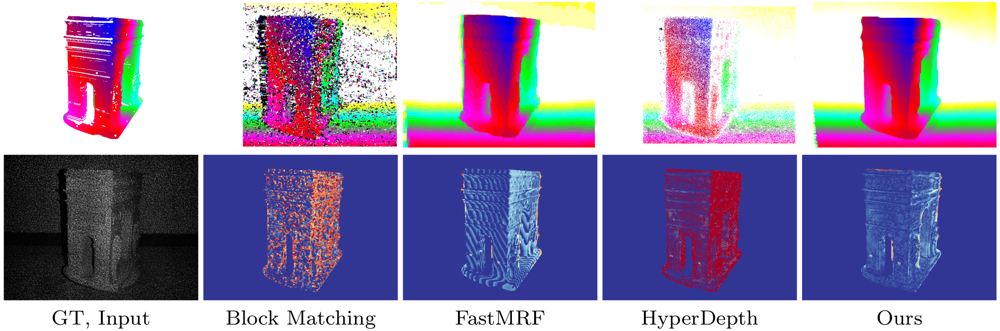

# Connecting the Dots: Learning Representations for Active Monocular Depth Estimation



This repository contains the code for the paper

**[Connecting the Dots: Learning Representations for Active Monocular Depth Estimation](TODO)**
<br>
[Gernot Riegler](https://griegler.github.io/), [Yiyi Liao](https://yiyiliao.github.io/), [Simon Donne](https://avg.is.tuebingen.mpg.de/person/sdonne), [Vladlen Koltun](http://vladlen.info/), and [Andreas Geiger](http://www.cvlibs.net/)
<br>
[CVPR 2019](http://cvpr2019.thecvf.com/)

> We propose a technique for depth estimation with a monocular structured-light camera, i.e., a calibrated stereo set-up with one camera and one laser projector. Instead of formulating the depth estimation via a correspondence search problem, we show that a simple convolutional architecture is sufficient for high-quality disparity estimates in this setting. As accurate ground-truth is hard to obtain, we train our model in a self-supervised fashion with a combination of photometric and geometric losses. Further, we demonstrate that the projected pattern of the structured light sensor can be reliably separated from the ambient information. This can then be used to improve depth boundaries in a weakly supervised fashion by modeling the joint statistics of image and depth edges. The model trained in this fashion compares favorably to the state-of-the-art on challenging synthetic and real-world datasets. In addition, we contribute a novel simulator, which allows to benchmark active depth prediction algorithms in controlled conditions.


If you find this code useful for your research, please cite

```
@inproceedings{Riegler2019Connecting,
  title={Connecting the Dots: Learning Representations for Active Monocular Depth Estimation},
  author={Riegler, Gernot and Liao, Yiyi and Donne, Simon and Koltun, Vladlen and Geiger, Andreas},
  booktitle={Proceedings of the IEEE Conference on Computer Vision and Pattern Recognition},
  year={2019}
}
```


## Dependencies

The network training/evaluation code is based on `Pytorch`.
```
PyTorch>=1.1
Cuda>=10.0
```

The other python packages can be installed with `anaconda`:
```
conda install --file requirements.txt
```

### Structured Light Renderer
To train and evaluate our method in a controlled setting, we implemented an structured light renderer.
It can be used to render a virtual scene (arbitrary triangle mesh) with the structured light pattern projected from a customizable projector location.
To build it, first make sure the correct `CUDA_LIBRARY_PATH` is set in `config.json`.
Afterwards, the renderer can be build by running `make` within the `renderer` directory.

### PyTorch Extensions
The network training/evaluation code is based on `PyTorch`.
We implemented some custom layers that need to be built in the `torchext` directory.
Simply change into this directory and run

```
python setup.py build_ext --inplace
```

### Baseline HyperDepth
As baseline we partially re-implemented the random forest based method [HyperDepth](http://openaccess.thecvf.com/content_cvpr_2016/papers/Fanello_HyperDepth_Learning_Depth_CVPR_2016_paper.pdf).
The code resided in the `hyperdepth` directory and is implemented in `C++11` with a Python wrapper written in `Cython`.
To build it change into the directory and run

```
python setup.py build_ext --inplace
```

## Running


### Creating synthetic data
To create synthetic data and save it locally, download [ShapeNet V2](https://www.shapenet.org/) and correct `SHAPENET_ROOT` in `config.json`. Then the data can be generated and saved to `DATA_ROOT` in `config.json` by running
```
./create_syn_data.sh
```

### Training Network

As a first stage, it is recommended to train the disparity decoder and edge decoder without the geometric loss. To train the network on synthetic data for the first stage run
```
python train_val.py
```

After the model is pretrained without the geometric loss, the full model can be trained from the initialized weights by running
```
python train_val.py --loss phge
```


### Evaluating Network
To evaluate a specific checkpoint, e.g. the 50th epoch, one can run 
```
python train_val.py --cmd retest --epoch 50
```


## Acknowledgement 
This work was supported by the Intel Network on Intelligent Systems.
